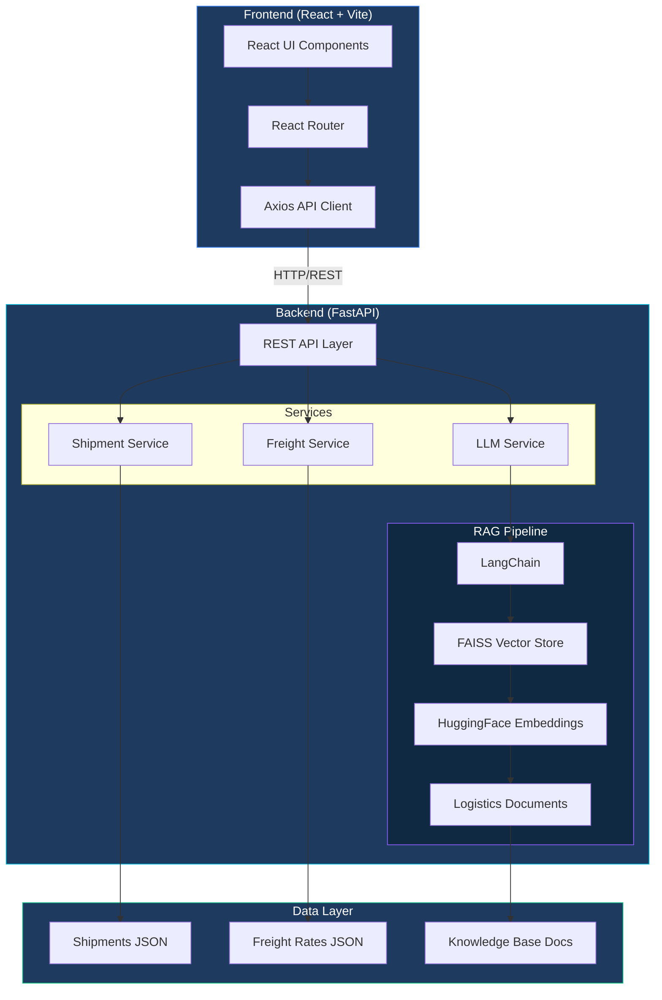

# 🚛 Logistics AI Tracker

[](https://react.dev)
[](https://fastapi.tiangolo.com)
[](https://langchain.com)
[](https://docker.com)
[](https://python.org)
[](LICENSE)

A full-stack logistics intelligence web application featuring real-time shipment tracking, freight rate management, and an AI-powered conversational assistant that answers natural language queries about shipments, delays, and freight rates using **Retrieval-Augmented Generation (RAG)**.

---

## ✨ Features

### 📊 Dashboard
- Real-time overview of all shipment statistics
- Quick-access cards for key actions
- Recent shipments at a glance

### 📦 Shipment Tracking
- Track shipments with detailed timeline visualization
- Filter by status: In Transit, Delivered, Delayed, Customs Hold
- Search by tracking number, origin, destination, or carrier
- Detailed shipment view with event timeline

### 💰 Freight Rates
- Compare rates across Air, Sea, Road, and Rail modes
- Filter by origin, destination, and transport mode
- Real-time freight quotes

### 🤖 AI Chat Assistant
- Natural language queries about shipments and logistics
- RAG-powered responses using logistics document knowledge base
- Contextual answers about delays, policies, and freight rates
- Suggested query chips for quick interactions

---

## 🏗️ Architecture



---

## 🛠️ Tech Stack

| Layer | Technology |
|-------|-----------|
| **Frontend** | React 19, Vite, React Router, Axios, Lucide Icons |
| **Backend** | FastAPI, Uvicorn, Pydantic |
| **AI/ML** | LangChain, FAISS, HuggingFace Embeddings, Sentence Transformers |
| **Containerization** | Docker, Docker Compose |
| **API** | RESTful API with OpenAPI/Swagger docs |

---

## 🚀 Quick Start

### Prerequisites
- [Docker](https://docker.com) & Docker Compose
- [Node.js 20+](https://nodejs.org) (for local frontend dev)
- [Python 3.11+](https://python.org) (for local backend dev)

### 🐳 Run with Docker (Recommended)

```bash
# Clone the repository
git clone https://github.com/Venkateswar8703/Logistics-AI-Tracker.git
cd Logistics-AI-Tracker

# Copy environment file
cp .env.example .env

# Build and start all services
docker-compose up --build

# Access the app
# Frontend: http://localhost:3000
# Backend API: http://localhost:8000
# API Docs: http://localhost:8000/docs
```

### 💻 Run Locally (Development)

#### Backend
```bash
cd backend

# Create virtual environment
python -m venv venv
source venv/bin/activate  # Linux/Mac
# or: venv\Scripts\activate  # Windows

# Install dependencies
pip install -r requirements.txt

# Start the server
uvicorn app.main:app --reload --port 8000
```

#### Frontend
```bash
cd frontend

# Install dependencies
npm install

# Start dev server
npm run dev
```

---

## 📡 API Endpoints

| Method | Endpoint | Description |
|--------|----------|-------------|
| `GET` | `/api/health` | Health check |
| `GET` | `/api/shipments` | List all shipments (with filters) |
| `GET` | `/api/shipments/stats` | Dashboard statistics |
| `GET` | `/api/shipments/{tracking_id}` | Get shipment details |
| `GET` | `/api/freight/rates` | List freight rates |
| `GET` | `/api/freight/quote` | Calculate freight quote |
| `POST` | `/api/chat` | Send AI chat message |
| `GET` | `/api/chat/suggestions` | Get suggested queries |

### Example: Track a Shipment
```bash
curl http://localhost:8000/api/shipments/SHP-001
```

### Example: Ask the AI Assistant
```bash
curl -X POST http://localhost:8000/api/chat \
  -H "Content-Type: application/json" \
  -d '{"message": "What is the status of shipment SHP-003?"}'
```

---

## 🤖 AI Assistant Capabilities

The AI assistant uses **Retrieval-Augmented Generation (RAG)** to answer questions:

- **Shipment Tracking**: "Where is SHP-005?" / "Show me delayed shipments"
- **Freight Queries**: "What's the cheapest way to ship from Shanghai to LA?"
- **Policy Questions**: "What is the insurance policy for fragile goods?"
- **Delay Information**: "Why are shipments getting delayed?" / "What are the SLA commitments?"

### LLM Configuration

By default, the app uses a **rule-based AI responder** that works without any API keys. To enable GPT-powered responses:

```bash
# In your .env file
OPENAI_API_KEY=your-api-key-here
```

---

## 📁 Project Structure

```
Logistics-AI-Tracker/
├── frontend/                 # React + Vite frontend
│   ├── src/
│   │   ├── components/       # Reusable UI components
│   │   ├── pages/            # Page components
│   │   ├── services/         # API service layer
│   │   └── App.jsx           # Root component
│   ├── Dockerfile
│   └── nginx.conf
├── backend/                  # FastAPI backend
│   ├── app/
│   │   ├── routers/          # API route handlers
│   │   ├── services/         # Business logic & AI
│   │   ├── models/           # Pydantic schemas
│   │   ├── data/             # Mock data & RAG docs
│   │   └── main.py           # App entry point
│   ├── Dockerfile
│   └── requirements.txt
├── docker-compose.yml
└── README.md
```

---

## 📸 Screenshots

### Dashboard
*Real-time logistics overview with shipment statistics and quick actions*

### Shipment Tracking
*Detailed shipment tracking with timeline visualization*

### AI Chat Assistant
*Natural language interface for logistics queries*

---

## 🔮 Future Enhancements

- [ ] PostgreSQL database integration
- [ ] Real-time WebSocket updates
- [ ] Interactive map visualization
- [ ] User authentication & role-based access
- [ ] Email/SMS notifications for shipment updates
- [ ] Advanced analytics and reporting
- [ ] Multi-language support

---

## 📄 License

This project is licensed under the MIT License - see the [LICENSE](LICENSE) file for details.

---

## 🙏 Acknowledgements

- [FastAPI](https://fastapi.tiangolo.com/) - Modern Python web framework
- [React](https://react.dev/) - UI library
- [LangChain](https://langchain.com/) - LLM application framework
- [FAISS](https://github.com/facebookresearch/faiss) - Vector similarity search
- [Lucide](https://lucide.dev/) - Beautiful icons

---

<p align="center">
  Built with ❤️ by <a href="https://github.com/Venkateswar8703">Venkateswar</a>
</p>
